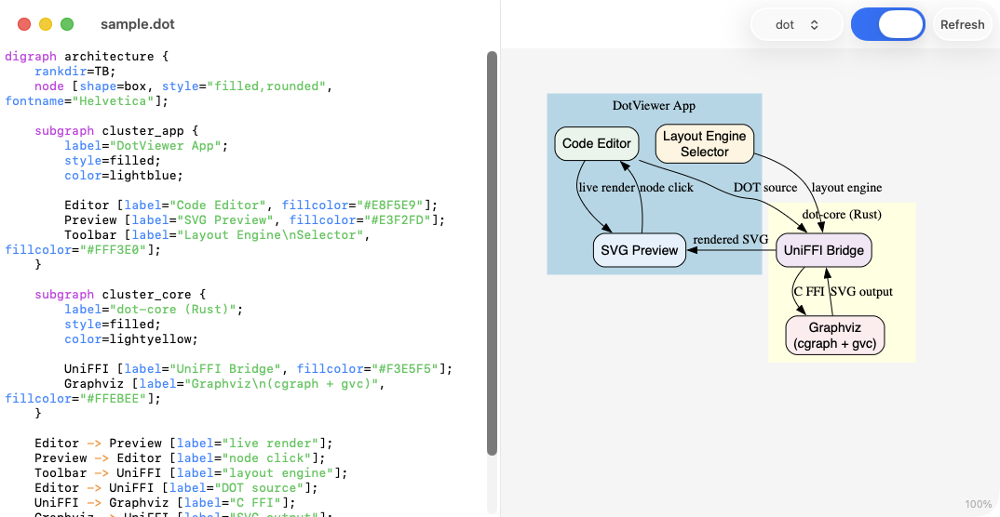

# Dot Viewer

View [Graphviz](https://graphviz.org/) `.dot` and `.gv` files three ways: a native macOS app, a web editor, or a terminal CLI.



## Download

Grab the latest macOS release from the [Releases page](https://github.com/2389-research/dot-viewer/releases). The DMG is code signed and notarized with Developer ID — just drag to Applications and launch.

Requires **macOS 14.0** or later. The app checks for updates automatically via Sparkle.

## Viewers

### macOS App

A native SwiftUI app with a split-pane editor and live SVG preview.

- **Live preview** — edits render to SVG in real time with debounced updates (300ms)
- **Multiple layout engines** — dot, neato, fdp, circo, twopi, sfdp selectable from the toolbar
- **Bidirectional navigation** — click a node in the preview to jump to its definition in the editor, and vice versa
- **Line numbers** — gutter with dynamic-width line numbers, current line highlighting, and click-to-select
- **Syntax highlighting** — visual cues for DOT keywords, strings, comments, attributes, and arrow operators
- **Bracket matching** — matching brackets are highlighted as you navigate the code
- **Tabbed editing** — open multiple `.dot`/`.gv` files as native macOS window tabs
- **Zoom and pan** — navigate large graphs in the SVG preview
- **Undo/redo** — standard document undo support
- **Error display** — inline error bar shows Graphviz rendering errors

### CLI (`dot-viewer`)

Renders DOT files as Unicode box-drawing art in the terminal.

```
$ dot-viewer graph.dot
      ┌───────┐
      │ start │
      └───────┘
          │
     ▼────└────▼
 ┌──────┐  ┌──────┐
 │ ⬭ a0 │  │ ⬭ b0 │
 └──────┘  └──────┘
     │          │
     └────▼─────┘
       ┌─────┐
       │ end │
       └─────┘
```

- **Shape icons** — nodes display a Unicode symbol for their Graphviz shape (◇ diamond, ⬭ ellipse, ○ circle, ◎ doublecircle, ■ Msquare, ★ star, etc.)
- **Verbose mode** (`-v`) — expands nodes to show all DOT attributes inside the box
- **Layout engines** — `--engine dot|neato|fdp|circo|twopi|sfdp`
- **Edge routing** — L-shaped routing with arrow indicators (▼▲►◄) snapped to node boundaries

### Web App

A SvelteKit web editor with CodeMirror and in-browser Graphviz rendering via WASM.

## Architecture

```
dot-core/          Rust library — Graphviz FFI (cgraph + gvc) via UniFFI bindings
dot-parser/        Rust library — DOT language parser with attribute extraction
dot-viewer-cli/    Rust CLI — ASCII rendering pipeline (plain format → grid → Unicode)
DotViewer/         SwiftUI macOS app — split-pane editor + preview
web/               SvelteKit web app — CodeMirror editor + WASM Graphviz
```

Graphviz 12.2.1 is compiled from source as a static library — no system Graphviz installation required.

## Building from Source

### Prerequisites

- macOS 14.0+ (for the macOS app; CLI works on any platform with Rust)
- Xcode 16.0+ (macOS app only)
- Rust toolchain (`rustup`)
- Homebrew (macOS)

### macOS App

```bash
git clone https://github.com/2389-research/dot-viewer.git
cd dot-viewer

# Install build tools
brew install xcodegen bison flex

# Clone Graphviz source (built by Cargo via CMake)
cd dot-core
git clone --depth 1 --branch 12.2.1 https://gitlab.com/graphviz/graphviz.git graphviz-vendor
cd ..

# Build everything (Rust core + Swift bindings + Xcode app)
make
```

To open in Xcode after building:

```bash
cd DotViewer && xcodegen generate
open DotViewer.xcodeproj
```

### CLI

```bash
# Requires the Graphviz vendor source (see above)
make build-cli

# Or install to your PATH
make install-cli

# Usage
dot-viewer path/to/graph.dot
dot-viewer path/to/graph.dot -v           # verbose (show attributes)
dot-viewer path/to/graph.dot --engine fdp  # alternate layout engine
```

### Web App

```bash
make web-dev    # development server
make web-build  # production build
```

### Running Tests

```bash
# CLI tests (25 unit + integration tests)
make test-cli

# macOS app unit tests (DotParser logic — 29 tests)
xcodebuild test -scheme DotViewer -configuration Debug -destination 'platform=macOS' -only-testing:DotViewerTests

# macOS app UI scenario tests (7 tests, requires macOS automation permission)
xcodebuild test -scheme DotViewer -configuration Debug -destination 'platform=macOS' -only-testing:DotViewerUITests

# Web app tests
make web-test
```

## Project Structure

```
.github/workflows/    GitHub Actions release pipeline
dot-core/             Rust library (Graphviz FFI + UniFFI bindings)
  build.rs            CMake build orchestration for vendored Graphviz
  src/                Rust source
dot-parser/           Shared DOT parser (used by CLI and macOS app)
dot-viewer-cli/       CLI ASCII renderer
  src/main.rs         Entry point and pipeline wiring
  src/plain.rs        Graphviz plain format parser
  src/grid.rs         Float-to-grid coordinate mapper with overlap resolution
  src/render.rs       Unicode box-drawing renderer with shape icons
DotViewer/            SwiftUI macOS app
  project.yml         XcodeGen spec
  DotViewer/          App source (views, document model, Sparkle updater)
  DotViewerTests/     Unit tests (DotParser)
  DotViewerUITests/   UI scenario tests
web/                  SvelteKit web app
scripts/              Build and release helper scripts
Makefile              Top-level build orchestration
```

## Releases

Releases are automated via GitHub Actions. Pushing a `v*` tag triggers the full pipeline: Rust build, Swift build, Developer ID signing, Apple notarization, DMG packaging, Sparkle appcast generation, and GitHub Release creation.
